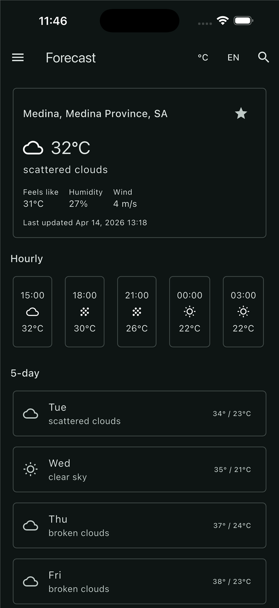
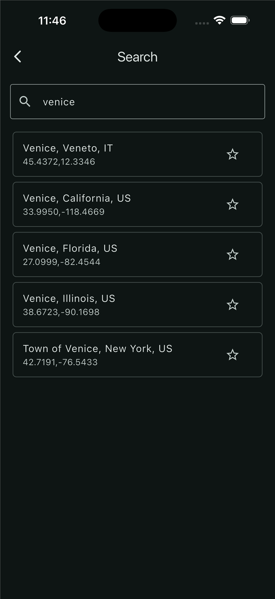

# PixelWeather

[](https://github.com/hossamsherif/pixel_weather_app/actions/workflows/flutter-pr-checks.yml)

A cross-platform **Flutter weather app** with a clean architecture, Riverpod state management, localization, favorites, caching, and home widget support.

PixelWeather is built as a polished weather experience that combines:
- **current weather**
- **hourly and daily forecasts**
- **location search**
- **GPS-based weather loading**
- **favorite locations**
- **offline/cache-aware behavior**
- **English and Arabic localization**

---

## 📸 Screenshots

<p align="center">
  
  
</p>

---

## ✨ Features

### Weather experience
- Current weather conditions
- Hourly forecast
- 5-day forecast
- Weather condition icons
- Metric / Imperial unit switching

### Location support
- Search for cities
- Use current GPS location
- Reverse geocoding for current location naming
- Save and reload last viewed location

### Personalization
- Favorite locations
- Quick favorite access
- Home widget integration
- Light/dark theme support
- English and Arabic support

### Reliability
- Local weather caching
- Cached fallback behavior when network calls fail
- Pull-to-refresh support
- Error states for location permissions, disabled services, and request failures

---

## 🧱 Tech Stack

### Core
- **Flutter**
- **Dart**

### State management & navigation
- **flutter_riverpod**
- **go_router**

### Data & storage
- **http**
- **shared_preferences**
- **json_annotation / json_serializable**

### Platform features
- **geolocator**
- **home_widget**

### Localization & testing
- **flutter_localizations**
- **intl**
- **flutter_test**
- **mocktail**

---

## 🏗 Project Structure

```text
lib/
├── core/
│   ├── config/
│   ├── services/
│   └── theme/
├── data/
│   ├── cache/
│   ├── favorites/
│   └── open_weather/
├── domain/
│   ├── models/
│   └── repositories/
├── l10n/
└── presentation/
    ├── screens/
    ├── shell/
    ├── state/
    └── widgets/
```

### Architecture overview
The app follows a layered structure:
- **presentation** → UI, screens, widgets, controllers/providers
- **domain** → app models and repository contracts
- **data** → API clients, repositories, caching, persistence
- **core** → app-wide config, services, theme

This keeps the codebase easier to test, reason about, and extend.

---

## 📱 Main Screens

- **Now**: current weather summary for the selected location
- **Forecast**: hourly + daily forecast details
- **Favorites**: saved locations with cached weather snapshots
- **Search**: search cities and quickly load weather data

---

## 🌍 Localization

The app currently supports:
- **English** (`en`)
- **Arabic** (`ar`)

Localization files live under `lib/l10n/`.

---

## 🧪 Testing

This project includes:
- unit tests
- widget tests
- controller/provider tests
- repository/data layer tests
- localization tests

### Coverage
Flutter line coverage is currently maintained at **80%+**.

Run tests locally with:

```bash
flutter test
```

Generate coverage locally with:

```bash
flutter test --coverage
```

---

## ✅ CI / Pull Request Checks

This repository uses **GitHub Actions** to validate pull requests automatically.

The PR workflow runs:

```bash
flutter pub get
dart format --output=none --set-exit-if-changed .
flutter analyze
flutter test --coverage
```

### Coverage requirement
Pull requests must maintain a minimum of **80% Flutter line coverage**.

The workflow reads `coverage/lcov.info` and fails if the total coverage drops below the threshold.

---

## 🚀 Getting Started

### Prerequisites
Make sure you have:
- Flutter installed
- Dart SDK installed through Flutter
- A device/emulator/simulator available

Check your setup with:

```bash
flutter doctor
```

### Install dependencies

```bash
flutter pub get
```

### Run the app

```bash
flutter run
```

---

## 🔑 API Configuration

The app uses the **OpenWeather** API.

### Recommended local setup

Copy the example file:

```bash
cp env/local.example.json env/local.json
```

Windows PowerShell:

```powershell
Copy-Item env/local.example.json env/local.json
```

Then add your real key to `env/local.json`:

```json
{
  "OPENWEATHER_KEY": "your_openweather_api_key_here"
}
```

> `env/local.json` is gitignored, so each developer only needs to create it once after cloning/pulling the repo.

Run the app with the local file:

```bash
flutter run --dart-define-from-file=env/local.json
```

VS Code users can also use the included launch configuration:
- `pixel_weather_app (dev local secrets)`

PowerShell users can use the helper script:

```powershell
./scripts/run-dev.ps1
./scripts/run-dev.ps1 -Target test
./scripts/run-dev.ps1 -Target apk
```

### Direct alternative

You can also pass the key directly:

```bash
flutter run --dart-define=OPENWEATHER_KEY=your_api_key_here
```

Example for tests or other Flutter commands:

```bash
flutter test --dart-define-from-file=env/local.json
flutter build apk --dart-define-from-file=env/local.json
```

If `OPENWEATHER_KEY` is missing, weather requests will fail with a missing API key error.
Do not hardcode production secrets in source files.

---

## 🧭 Development Notes

### Formatting

```bash
dart format .
```

### Static analysis

```bash
flutter analyze
```

### Recommended pre-push check

```bash
dart format .
flutter analyze
flutter test
```

---

## 🔮 Possible Next Improvements

- screenshot/golden testing for core screens
- native widget tests for iOS and Android widget layers
- richer weather visuals and animations
- more robust offline-first behavior
- coverage reporting to PR comments or badges

---

## 🤝 Contributing

Contributions are welcome.

Before opening a PR:
1. format the code
2. run `flutter analyze`
3. run `flutter test`
4. ensure coverage stays above **80%**

---

## 📚 Helpful Flutter Resources

- [Flutter documentation](https://docs.flutter.dev/)
- [Write your first Flutter app](https://docs.flutter.dev/get-started/codelab)
- [Flutter cookbook](https://docs.flutter.dev/cookbook)

---

Built with Flutter and a lot of weather-driven test coverage ☁️📱
